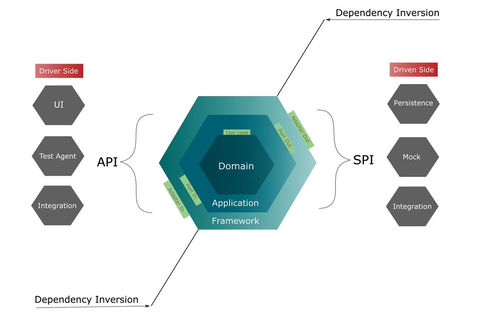

# Topology Inventory — Hexagonal Architecture with Java

Sistema de inventario de red y topología (routers, switches y redes) que modela
el dominio de una operadora de telecomunicaciones. Construido con arquitectura
hexagonal, DDD y Java Modules (JPMS) para aislar el núcleo de negocio de los
detalles tecnológicos, y ejecutado sobre Quarkus para entornos cloud-native. Se
desarrolla de forma incremental, añadiendo capacidades por fases.

## Stack tecnológico

| Tecnología | Versión | Rol en el sistema |
|------------|---------|-------------------|
| Java | 21 (LTS) | Lenguaje base |
| Maven | 3.9.x | Build multi-módulo |
| Java Modules (JPMS) | — | Aísla los hexágonos y fuerza la inversión de dependencias |
| Lombok | 1.18.34 | Reduce boilerplate en el modelo de dominio |
| Quarkus | 3.33 (LTS) | Runtime cloud-native: motor de arranque y de persistencia |
| Jakarta Persistence (JPA) | Quarkus BOM | API de persistencia (frontera de salida) |
| Hibernate ORM | Quarkus BOM | Proveedor JPA gestionado por Quarkus; genera el DDL desde las entidades |
| H2 | Quarkus BOM | Base de datos en memoria (driver `quarkus-jdbc-h2`) |
| Agroal / Narayana JTA | Quarkus BOM | Pool de conexiones y transacciones (frontera de salida) |
| Jandex (SmallRye) | 3.5.3 | Índice de clases en build-time (descubrimiento de entidades entre módulos) |
| JUnit | 5.11.x · 6.0.3 (framework) | Tests unitarios y de integración (`@QuarkusTest`) |
| Cucumber | 7.20.x | Tests de aceptación (BDD) sobre JUnit 5 Platform |

## Arquitectura



El sistema se organiza en tres hexágonos concéntricos. Una petición entra por el
**Framework hexagon** a través de un *input adapter* (REST, gRPC…), que la
entrega a un *input port* del **Application hexagon**. El input port implementa un
*use case* y orquesta las reglas del **Domain hexagon** (entities, value objects y
specifications). Cuando el caso de uso necesita datos externos, los solicita
mediante un *output port* (una abstracción), que un *output adapter* del Framework
hexagon resuelve contra la tecnología concreta (base de datos, broker…). La
dirección de dependencia siempre apunta hacia adentro: el negocio no conoce la
tecnología, y por eso puede evolucionar sin verse arrastrado por cambios de
framework.

Sobre esa base, el runtime cloud-native arranca con Quarkus: el módulo `bootstrap`
enciende el contenedor (`@QuarkusMain`) y el output adapter obtiene su
`EntityManager` gestionado del contenedor, sin que el dominio ni la aplicación
lleguen a conocer el framework de arranque.

## Módulos

| Módulo (JPMS) | Hexágono | Responsabilidad |
|---------------|----------|-----------------|
| `domain` | Domain | Entities, value objects, domain services y specifications |
| `application` | Application | Use cases e input/output ports |
| `framework` | Framework | Input/output adapters: persistencia H2/JPA con Hibernate ORM gestionado por Quarkus (salida) y adapters genéricos de entrada |
| `bootstrap` | — | Ensambla los hexágonos y arranca la aplicación bajo Quarkus (`@QuarkusMain`); única costura con `quarkus.core` |

## Decisiones técnicas

- **Java 21 (LTS)** por records, pattern matching y virtual threads.
- **Java Modules (JPMS)** para forzar la inversión de dependencias y garantizar
  que el dominio no dependa de la infraestructura.
- **Patrón Specification** para expresar las reglas de negocio como objetos
  componibles y testables de forma aislada, en lugar de condicionales dispersos.
- **Jakarta EE 10 (`jakarta.*`)** como base del stack empresarial.
- **Hibernate ORM (gestionado por Quarkus) + H2** en memoria en la frontera de
  salida, aislados del dominio mediante mappers; el DDL lo genera Hibernate desde
  las entidades y el seed vive en `import.sql`.
- **Persistencia gestionada por el contenedor sin acoplar los hexágonos:** el
  output adapter obtiene el `EntityManager` por la SPI estándar `CDI.current()` y
  demarca la transacción con `UserTransaction`, permaneciendo cableado por
  `ServiceLoader` (binding portado a `META-INF/services` para el classpath de
  Quarkus). Así el hexágono de `framework` no requiere ningún módulo de Quarkus.
- **Quarkus 3.33 (LTS)** por su arranque rápido y su enfoque cloud-native; la
  costura JPMS↔Quarkus queda solo en el módulo `bootstrap` (`@QuarkusMain`,
  command mode).

## Ejecución

**Prerrequisitos:** JDK 21 y Maven 3.9+.

```bash
# Compilar y ejecutar los tests de todo el proyecto
mvn clean verify

# Solo el módulo de dominio
mvn -pl domain test

# Empaquetar la aplicación Quarkus (fast-jar)
mvn clean package

# Ejecutar el flujo de demostración (command mode): arranca, persiste y recupera, y termina
java -jar bootstrap/target/quarkus-app/quarkus-run.jar

# Modo dev con recarga en caliente
mvn -pl bootstrap -am quarkus:dev
```

## Estado del proyecto

| Fase | Incremento | Estado |
|------|------------|--------|
| 1 | Modelo de dominio (entities, value objects, reglas de negocio) | ✅     |
| 2 | Casos de uso y puertos (capa de aplicación) | ✅     |
| 3 | Adapters y frontera tecnológica (capa de framework) | ✅     |
| 4 | Inversión de dependencias entre módulos (JPMS) | ✅     |
| 5 | Integración cloud-native con Quarkus | ✅     |
| 6 | Gestión del ciclo de vida con CDI | ⏸️      |
| 7 | API REST reactiva | ⏸️      |
| 8 | Persistencia reactiva | ⏸️      |
| 9 | Contenedores y despliegue (Docker / Kubernetes) | ⏸️      |
| 10 | Endurecimiento y buenas prácticas | ⏸️      |
